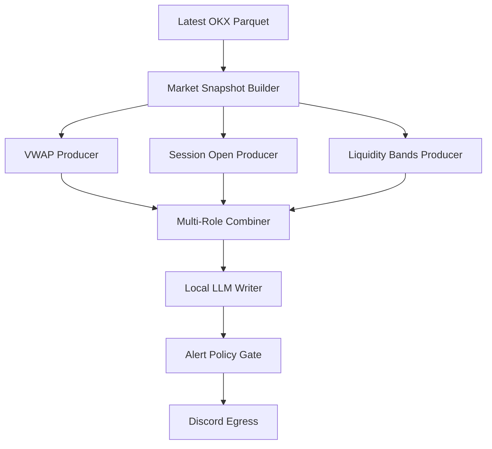

# Quant-Grade Market Desk

**Market context, not blind signals.**

Local-first AI market context pipeline for structured crypto intelligence, risk-aware reports, policy-gated LLM summaries, and Discord-ready delivery. Built by Ravebear.

## What It Is

Quant-Grade Market Desk is a deterministic market intelligence pipeline. It autonomously bridges the gap between raw quantitative metrics and actionable narrative context. The system:
- Reads highly-validated local market data (e.g. Parquet files).
- Builds structured snapshots bridging raw data to analyst modules.
- Generates precise packets covering VWAP topography, Session boundaries, and Liquidity band compression.
- Combines these structural data points deterministically.
- Asks a localized Large Language Model (LLM) to translate this pure context into a concise, readable market report.
- Subjects the report to a rigid Alert Policy Gate, discarding duplicate/cooldown triggers or unsafe terms.
- Safely delivers the finalized intel directly to a Discord webhook for review.

## What It Is Not

- **Not financial advice**
- **Not trade execution**
- **Not a buy/sell signal room**
- **Not a guaranteed-profit system**
- **Not an exchange collector inside this repo** (The pipeline consumes locally prepared data generated externally).

## Current Pipeline



## Frozen v0.1 Modules

The pipeline guarantees data integrity via fail-closed module isolation. Current established domains:

- `integrations/discord_webhook_egress`
- `analysts/vwap_packet_producer`
- `analysts/session_open_packet_producer`
- `analysts/liquidity_bands_packet_producer`
- `analysts/multi_role_market_read_combiner`
- `analysts/local_llm_market_report_writer`
- `policy/alert_policy_gate`
- `context/market_snapshot_builder`
- `context/latest_parquet_resolver`
- `pipelines/market_report_pipeline_runner`
- `ops/operator_run_profiles`
- `ops/controlled_run_supervisor`

## Quickstart: Safe Dry Run

Execute the full context-gathering, LLM writing, and policy gating loop safely without broadcasting:

```bash
python -m ops.operator_run_profiles.cli run --profile dry_run_latest --symbol BTC-USDT-SWAP
```

## Controlled Repeated Run

Execute a bounded foreground polling loop (e.g. 3 cycles, 5 minutes apart) securely:

```bash
python -m ops.controlled_run_supervisor.cli run --profile dry_run_latest --symbol BTC-USDT-SWAP --interval-seconds 300 --max-runs 3
```

## Live Discord Mode

> [!WARNING]  
> Never commit or print webhook URLs inside the codebase or logs. 

To run the pipeline and securely deliver approved intel via Discord, the environment must contain your webhook address. 

```env
DISCORD_WEBHOOK_URL="https://discord.com/api/webhooks/YOUR/TOKEN"
```

Once secured, you may execute:

```bash
python -m ops.operator_run_profiles.cli run --profile send_if_allowed_latest --symbol BTC-USDT-SWAP
```

## Local LLM Requirement

The pipeline delegates natural language narrative mapping to a local LLM API (e.g., LM Studio, vLLM). It expects an OpenAI-compatible endpoint.

Required Environment Variables:
```env
LOCAL_LLM_BASE_URL=http://localhost:1234/v1
LOCAL_LLM_MODEL=llama-3.2-3b-instruct
```

## Data Requirement

This codebase isolates orchestration from exchange scraping. In `latest` mode, it natively discovers external local OKX `.parquet` files from an external collector path shaped like:

`C:\CryptoSystems\Collector - OKX\data\normalized\okx\candles`

## Safety Design

The Quant-Grade Market Desk is secured by design:
- **Fail-Closed Schemas**: If a parquet file is corrupt or an LLM drifts structurally, the system halts instantly.
- **Forbidden-Language Guards**: Hardcoded regex blocks explicitly forbid "buy/sell here", "financial advice", "guaranteed", etc., from passing combiner pipelines.
- **Message Length Guards**: Webhook payload sizes are constrained.
- **Alert Policy Gate**: All outputs run through a policy filter enforcing structural intent.
- **Duplicate/Cooldown Protection**: Prevents spamming alerts during oscillating bounds.
- **Default Dry-Run Behavior**: Subprocesses never issue `POST` commands unless the highest level operator wrapper explicitly cascades `--send`.

## Roadmap

Scheduled capabilities deferred to later phases:
- RVOL producer
- CVD producer
- BBO/order book ingestion
- Coinbase/Kraken provider adapters
- dashboard
- AI debate personas
- user memory / DMs
- token/payment layer
- background scheduler/service
- fast scalp alert layer
